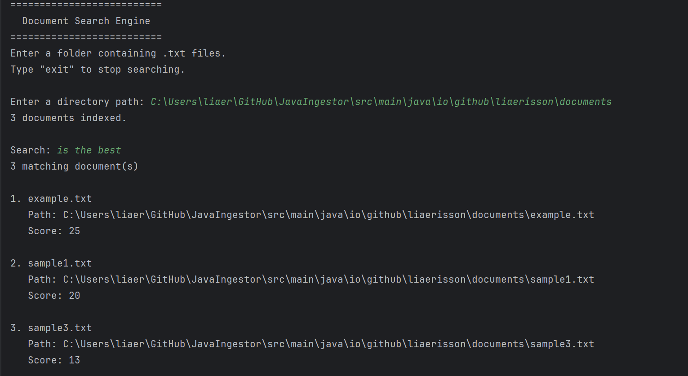

# Java Document Search Engine

A command-line search engine built from scratch in Java.

The program reads `.txt` files from a user-selected directory, builds an inverted index, and returns ranked results for single- and multi-word queries.



I built this project to strengthen my understanding of software design, Java collections, file processing, and unit testing while learning how keyword search works internally.

## Features

* Loads `.txt` files recursively from a directory
* Converts files into `Document` objects with unique IDs
* Normalizes documents and queries through the same tokenizer
* Builds an in-memory inverted index
* Tracks term frequency by document
* Supports single- and multi-term queries
* Uses OR search semantics
* Ranks results by combined query-term frequency
* Provides an interactive command-line interface
* Includes unit and integration tests

## Architecture

```text
DocumentLoader
      ↓
   Document
      ↓
   Tokenizer
      ↓
InvertedIndex
      ↓
QueryProcessor
      ↓
 SearchEngine
      ↓
  SearchCli
```

### Core classes

* **`Document`** — stores a document ID, filename, path, and content
* **`DocumentLoader`** — reads `.txt` files and creates `Document` objects
* **`Tokenizer`** — lowercases text, replaces punctuation, and splits on whitespace
* **`InvertedIndex`** — maps each term to the documents containing it and their occurrence counts
* **`QueryProcessor`** — combines term matches, calculates scores, and sorts results
* **`SearchResult`** — stores a matching document and its score
* **`SearchEngine`** — provides a simple public interface for indexing and searching
* **`SearchCli`** — handles terminal input and output

The central data structure is:

```java
Map<String, Map<Integer, Integer>>
```

which represents:

```text
term → document ID → occurrence count
```

## Search Behavior

For a query such as:

```text
java search
```

the processor retrieves the postings for each term and combines their frequencies by document.

```text
java   → {1=3, 2=1}
search → {1=1, 3=2}

scores:
document 1 → 4
document 2 → 1
document 3 → 2
```

Results are returned in descending score order.

Queries use OR semantics, so a document is included if it contains at least one query term.

## Testing

The project includes tests for:

* tokenizer normalization and punctuation handling
* spaces, tabs, line breaks, and empty input
* term-frequency counts
* duplicate document IDs
* single- and multi-term queries
* missing query terms
* result scoring and ordering
* the full `SearchEngine` workflow

Testing was a major focus of the project. I used the test suite both to verify individual classes and to catch edge cases in the interaction between tokenization, indexing, and query processing.

## Running the Project

### Requirements

* Java Development Kit 21 or newer
* Git

I included the Maven wrapper in the repository, so it does not need to be installed.

### 1. Clone the Repo

```bash
git clone https://github.com/liaerisson/JavaIngestor.git
cd JavaIngestor
```

### 2. Run the tests

On Windows PowerShell:

```powershell
.\mvnw.cmd clean test
```

On macOS/Linux:

```bash
./mvnw clean test
```

After these run, you see:

```text
BUILD SUCCESS
```

### 3. Build the executable JAR

On Windows PowerShell:

```powershell
.\mvnw.cmd clean package
```

On macOS or Linux:

```bash
./mvnw clean package
```

This creates:

```text
target/JavaIngestor-1.0-SNAPSHOT.jar
```

### 4. Start the search engine

```bash
java -jar target/JavaIngestor-1.0-SNAPSHOT.jar
```

The application will prompt you to enter the path to a directory containing `.txt` files:

```text
==========================
  Document Search Engine
==========================
Enter a folder containing .txt files.
Type "exit" to stop searching.

Enter a directory path:
```

After the files are indexed, enter a single- or multi-word search query:

```text
Search: java indexing
```

Results are displayed in descending score order:

```text
2 matching document(s)

1. backend.txt
   Path: sample-documents/backend.txt
   Score: 5

2. indexing.txt
   Path: sample-documents/indexing.txt
   Score: 2
```

Enter `exit` at the search prompt to close the application.


## Design Goals

This project was intentionally built without a search library so I could work through the underlying data structures and design decisions myself.

The main goals were to:

* separate responsibilities across small, focused classes
* use Java collection interfaces appropriately
* keep query-specific state local
* maintain consistent processing between documents and queries
* build confidence writing unit and integration tests
* create a clean public interface over the internal search components

## What I Learned

Through the project, I gained practical experience with:

* Java string immutability and `StringBuilder`
* regular expressions and text normalization
* `Path`, `Files.walk`, streams, and `BufferedReader`
* nested hash maps
* object references and shared mutable structures
* comparators and result ordering
* method decomposition and class responsibility
* unit and integration testing

## Current Limitations

* supports `.txt` files only
* uses raw term frequency rather than TF-IDF or BM25
* does not support phrase search, stemming, or stop-word filtering
* stores the index in memory

## Next Steps

* improve ranking with TF-IDF or BM25
* add result snippets
* expose the search engine through a Spring Boot API

## Status

The command-line MVP is complete and publicly available.